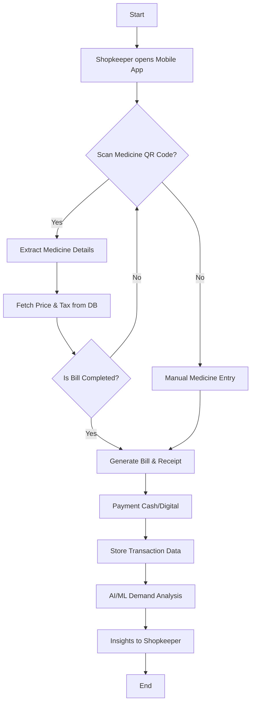

# 💊 Medbill – Smart Pharmacy Billing System

**Medbill** is a mobile-based pharmacy billing system designed to replace traditional manual processes and complex POS hardware with a fast, AI-powered solution. By leveraging QR scanning and machine learning, we turn raw transaction data into actionable business intelligence.

---

## 👨‍💻 Team: Bill Wizards
We are **Bill Wizards** because we transform traditional pharmacy billing into a fast, intelligent, and almost magical experience.

| Name | USN |
| :--- | :--- |
| **Het Limbani** | 1AUA23BCS063 |
| **Shriman Dasadiya** | 1AUA23BCS174 |
| **Kaloliya Gaurav** | 1AUA24BCS906 |
| **Saiyam Shah** | 1AUA23BCS166 |

---

## 🚀 Project Overview
Medbill bridges the gap between healthcare and technology. It automates the checkout process, minimizes human error, and provides pharmacy owners with deep insights into their inventory and sales trends.

### ✨ Key Objectives
* **Automate Billing:** Rapid QR-based entry.
* **Accuracy:** Eliminate manual calculation errors.
* **AI Insights:** Use ML to predict demand and stock requirements.
* **Data-Driven Decisions:** Transition from "guessing" to "knowing" based on analytics.

---

## 🧩 System Workflow
The following diagram illustrates the seamless transition from medicine scanning to AI-driven reporting:

## 🏗️ Overall Description

### 3.1 Product Perspective

Medbill belongs to the **Healthcare Technology domain**, integrating:

- 📱 Mobile-based billing  
- 🤖 AI/ML analytics  
- ☁️ Cloud-based storage  

---

### 3.2 User Classes

- **Pharmacy Owners** → Analytics & insights  
- **Pharmacy Staff** → Fast billing system  
- **Customers** → Quick checkout  
- **Suppliers** → Demand data  
- **Government Systems** → Trend analysis  

---

### 3.3 Product Functions

- ✅ QR/Barcode-based billing  
- 📊 Sales data storage  
- 📈 Visualization (weekly/monthly/yearly)  
- 🤖 AI/ML demand prediction  
- 📄 Intelligent reporting  

---

### 3.4 Operating Environment

- Android / iOS devices  
- Internet connectivity  
- Camera-enabled devices  
- Backend + AI servers  

---

### 3.5 Design Considerations

#### 🚨 Problems Solved

- Manual billing delays  
- Calculation errors  
- Poor inventory visibility  
- No structured data  

#### 🎉 Benefits

- Faster billing  
- Accurate records  
- Demand prediction  
- Reduced expiry losses  

---

## 🚀 System Features

### 🔥 Core Features (High Priority)

- QR Code Scanning  
- Automatic Bill Generation  
- Secure Data Storage  
- AI Demand Analysis  

---

### ⚙️ Functional Requirements

- QR Code Scanning  
- Automatic Billing  
- Sales Data Storage  
- Sales Visualization  
- AI/ML Prediction  
- Report Generation  
- Inventory Monitoring  

---

## 📊 Expected Outcomes

- ⚡ Faster billing  
- ⏱ Reduced waiting time  
- ❌ Fewer errors  
- 📊 Structured data  
- 📦 Better inventory management  

---

## 📌 Use Case Specifications

### 1. QR Code Billing

- Scan medicine  
- Fetch details  
- Generate bill  

👉 **Outcome:** Fast & accurate billing  

---

### 2. Fast Checkout

- No manual entry  
- Reduced errors  

👉 **Outcome:** Efficient workflow  

---

### 3. Sales Data Storage

- Stores transaction data  
- Maintains history  

👉 **Outcome:** Reliable records  

---

### 4. Analytics & Visualization

- Charts & reports  
- Custom filters  

👉 **Outcome:** Business insights  

---

### 5. AI/ML Demand Analysis

- Predict trends  
- Identify demand  

👉 **Outcome:** Smart inventory planning  

---

### 6. Inventory Optimization

- Prevent overstocking  
- Reduce expiry losses  

👉 **Outcome:** Cost savings  

---

## 🧠 Tech Stack

### Frontend
- ⚛️ React Native (TypeScript)

### Backend
- 🐍 Flask (Python)

### Database
- 🌐 Neon Tech (Serverless PostgreSQL)

### AI/ML
- 🤖 Python (Pandas, Scikit-learn)

---

## 📌 Future Enhancements

- 🔄 Real-time inventory sync  
- 🔗 Supplier integration  
- 🎤 Voice-based billing  
- 📶 Offline mode  

---