<p align="center">
  
</p>

## Medbill – Smart Pharmacy Billing System

[](#-about-the-team--bill-wizards)
[](https://opensource.org/licenses/MIT)

**Medbill** is a mobile-based pharmacy billing system designed to replace traditional manual processes and complex POS hardware with a fast, AI-powered solution. By leveraging QR scanning and machine learning, we turn raw transaction data into actionable business intelligence.

---

## 👨‍💻 Team: Bill Wizards
We are **Bill Wizards** because we transform traditional pharmacy billing into a fast, intelligent, and almost magical experience.

| Name | USN |
| :--- | :--- |
| **Het Limbani** | 1AUA23BCS063 |
| **Shriman Dasadiya** | 1AUA23BCS174 |
| **Kaloliya Gaurav** | 1AUA24BCS906 |
| **Saiyam Shah** | 1AUA23BCS166 |

---

## 🚀 Project Overview
Medbill bridges the gap between healthcare and technology. It automates the checkout process, minimizes human error, and provides pharmacy owners with deep insights into their inventory and sales trends.

### ✨ Key Objectives
* **Automate Billing:** Rapid QR-based entry.
* **Accuracy:** Eliminate manual calculation errors.
* **AI Insights:** Use ML to predict demand and stock requirements.
* **Data-Driven Decisions:** Transition from "guessing" to "knowing" based on analytics.

---

> ⚠️ **Note:** As students, we were unable to use paid Indian medicine APIs.  
> Instead, we used the free [OpenFoodFacts API](https://world.openfoodfacts.org), which provides similar functionality (barcode scanning, product name, and manufacturer details).  
> The AI/ML model is trained on actual medicine datasets, ensuring accurate analysis and predictions.

---

## 🧩 System Workflow
The following diagram illustrates the seamless transition from medicine scanning to AI-driven reporting:

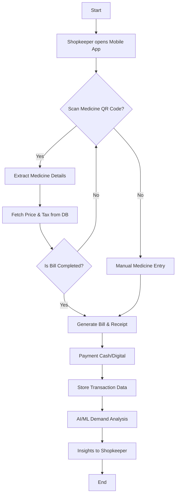

## 🏗️ Overall Description

<details open>
<summary><strong>3.1 Product Perspective</strong></summary>

Medbill belongs to the **Healthcare Technology domain**, integrating:

- 📱 Mobile-based billing  
- 🤖 AI/ML analytics  
- ☁️ Cloud-based storage  

</details>

---

<details open>
<summary><strong>3.2 User Classes</strong></summary>

- **Pharmacy Owners** → Analytics & insights  
- **Pharmacy Staff** → Fast billing system  
- **Customers** → Quick checkout  
- **Suppliers** → Demand data  
- **Government Systems** → Trend analysis  

### 📷 User Classes Diagram
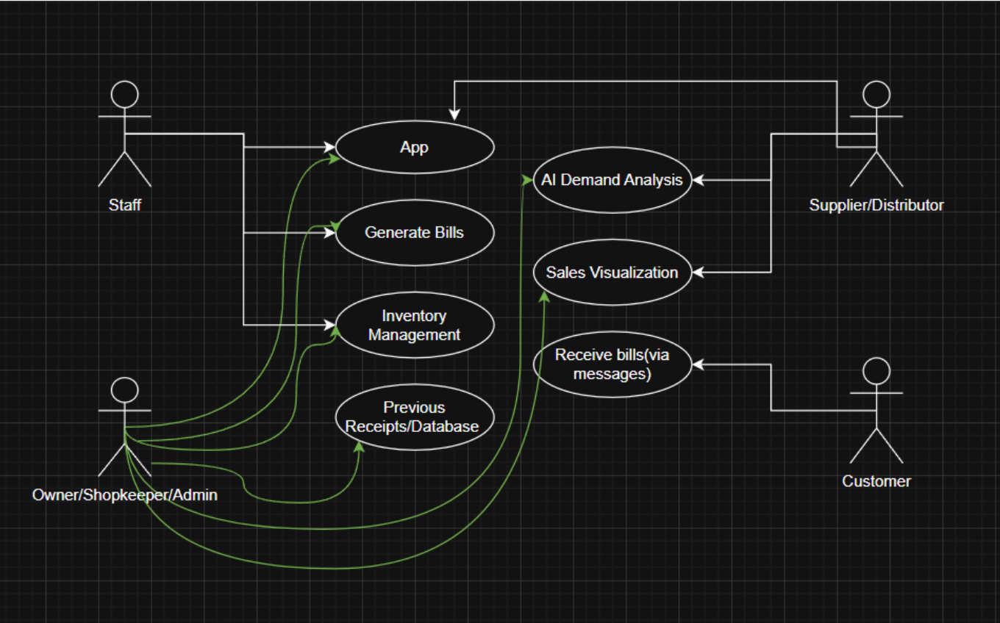

</details>

---

<details>
<summary><strong>3.3 Product Functions</strong></summary>

- ✅ QR/Barcode-based billing  
- 📊 Sales data storage  
- 📈 Visualization (weekly/monthly/yearly)  
- 🤖 AI/ML demand prediction  
- 📄 Intelligent reporting  

</details>

---

<details>
<summary><strong>3.4 Operating Environment</strong></summary>

- Android / iOS devices  
- Internet connectivity  
- Camera-enabled devices  
- Backend + AI servers  

</details>

---

<details>
<summary><strong>3.5 Design Considerations</strong></summary>

#### 🚨 Problems Solved

- Manual billing delays  
- Calculation errors  
- Poor inventory visibility  
- No structured data  

#### 🎉 Benefits

- Faster billing  
- Accurate records  
- Demand prediction  
- Reduced expiry losses  

</details>

---

## 🚀 System Features

<details open>
<summary><strong>🔥 Core Features (High Priority)</strong></summary>

- QR Code Scanning  
- Automatic Bill Generation  
- Secure Data Storage  
- AI Demand Analysis  

</details>

---

<details>
<summary><strong>⚙️ Functional Requirements</strong></summary>

- QR Code Scanning  
- Automatic Billing  
- Sales Data Storage  
- Sales Visualization  
- AI/ML Prediction  
- Report Generation  
- Inventory Monitoring  

</details>

---

## 📊 Expected Outcomes

- ⚡ Faster billing  
- ⏱ Reduced waiting time  
- ❌ Fewer errors  
- 📊 Structured data  
- 📦 Better inventory management  

---

## 🛠️ The Tech Stack: Under the Hood

We chose a modern, scalable, and developer-friendly stack to ensure **Medbill** is both performant and intelligent.

### 📱 Frontend (Mobile App)
* **React Native (TypeScript):** For building a truly cross-platform experience (iOS & Android) with a single codebase. TypeScript ensures type safety, reducing bugs in the billing logic.
* **Expo:** Streamlines the development process and provides easy access to native device features like the **Camera** for QR scanning.

### 🏗️ Backend & API
* **Flask (Python):** A lightweight and powerful micro-framework. It acts as the bridge between our mobile frontend and our AI logic, providing fast and secure RESTful APIs.

### 🗄️ Database & Storage
* **Neon Tech (PostgreSQL):** A serverless PostgreSQL database that scales automatically. It offers "database branching," allowing us to test new features safely without affecting live billing data.

### 🤖 Intelligence (AI/ML)
* **Python (Pandas & Scikit-learn):** The powerhouse of our demand analysis. 
    * **Pandas:** Cleans and processes raw transaction data.
    * **Scikit-learn:** Implements regression and classification models to predict future stock requirements based on historical sales.
* **Matplotlib / Chart.js:** Used to transform complex ML predictions into easy-to-read visual insights for the shopkeeper.


---

## 🔁 Sequence Diagram

### 📷 System Sequence Flow
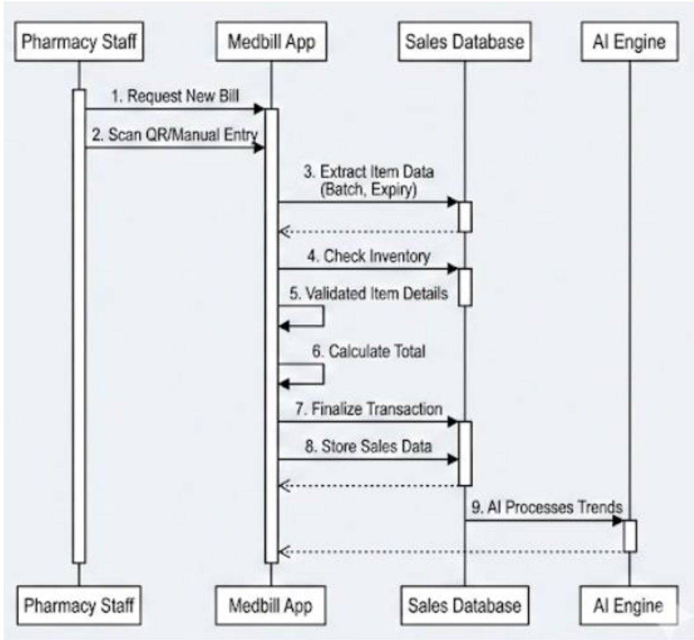

---

## 📂 Project Structure

Medbill follows a clean, decoupled architecture separating the **mobile frontend** from the **AI-powered backend**.

```text
Medbill/
├── 📱 frontend/                     # React Native (TypeScript) App
│   ├── assets/                     # Images, icons, fonts
│   ├── app/
│   │   ├── tabs/                   # Main screens (_layout.tsx, index.tsx, inventory, insights, receipts, settings)
│   │   ├── CartContext.tsx         # Global cart state management
│   │   ├── HelpSupport.tsx
│   │   ├── LandingPage.tsx
│   │   ├── SignIn.tsx
│   │   ├── SignUp.tsx
│   │   └── ...                     # Other screens/components
│   ├── app.json
│   └── ...
│
├── ⚙️ backend-flask/               # Flask (Python) Backend API
│   ├── app/
│   │   ├── models/                # Data models + AI/ML logic
│   │   │   ├── __init__.py
│   │   │   ├── demand_model.py    # Demand prediction (CatBoost / Scikit-learn)
│   │   │   ├── medicine_model.py
│   │   │   ├── receipts_model.py
│   │   │   └── user_model.py
│   │   │
│   │   ├── routes/                # API routes
│   │   │   ├── __init__.py
│   │   │   ├── auth_routes.py
│   │   │   ├── insights.py
│   │   │   ├── medicine_routes.py
│   │   │   └── receipt_routes.py
│   │   │
│   │   └── __init__.py
│   │
│   ├── catboost_info/             # Model training metadata
│   ├── .env                       # Environment variables (DB URI, secrets)
│   ├── requirements.txt           # Python dependencies
│   └── run.py                     # Entry point for Flask server
│
├── 📁 ss/                         # Screenshots & diagrams
│   ├── usecase.png
│   ├── sequence.png
│   └── ...
│
└── 📜 README.md                   # Project documentation

```

## 📸 Application Screenshots

Below are the key screens of the Medbill application:

| 🖼️ Screen | 📷 Preview |
|----------|-----------|
| **1. Landing Page** | 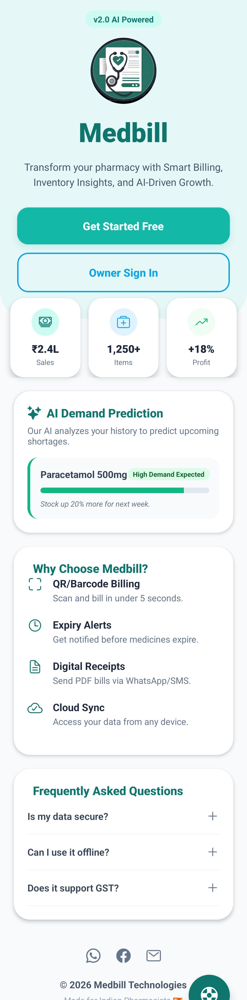 |
| **2. Sign In Page** | 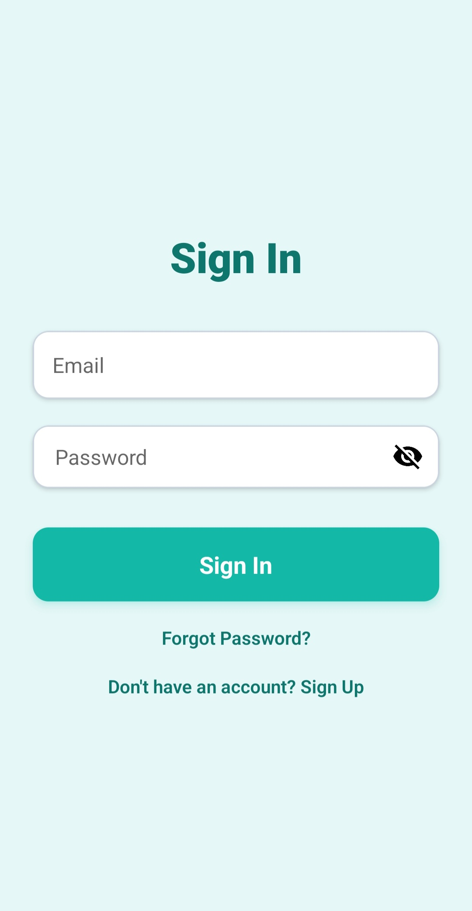 |
| **3. Sign Up Page** | 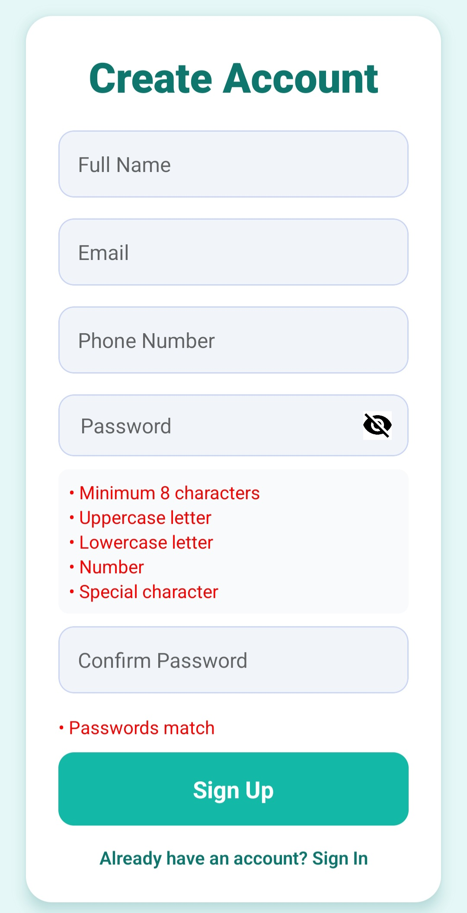 |
| **4. Scan QR / Barcode Page** <br> *(Manual entry available)* | 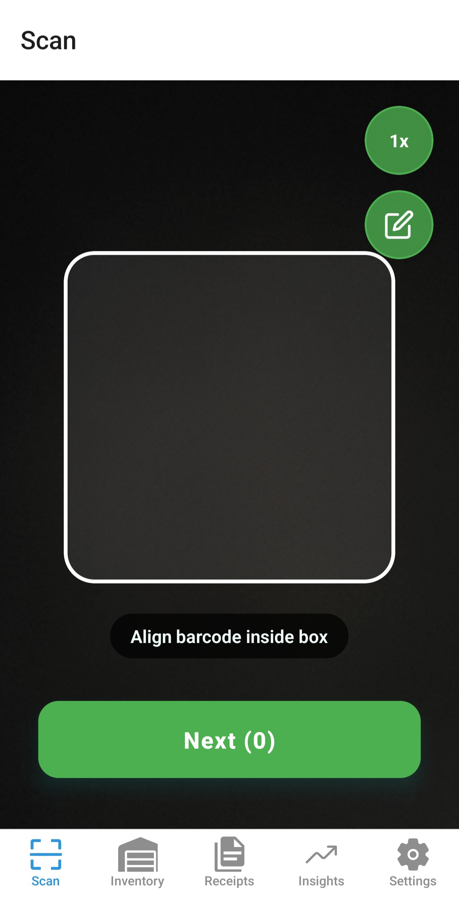 |
| **5. QR Preview Page** <br> *(Remove medicine)* | 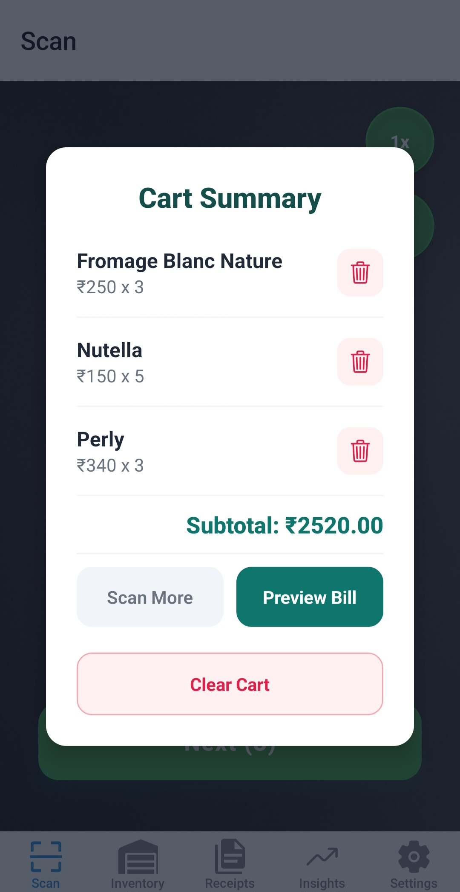 |
| **6. Final Invoice Preview Page** | 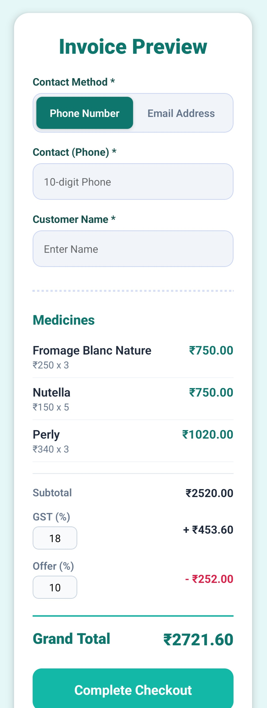 |
| **7. Inventory Page** <br> *(All stock shown)* | 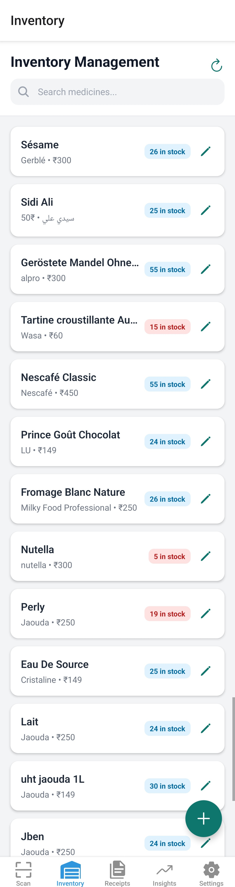 |
| **8. Add / Update Stock Page** <br> *(Update if exists, else new medicine + manual entry)* | 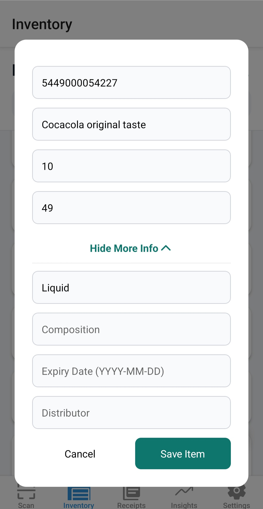 |
| **9. All Receipts Page** | 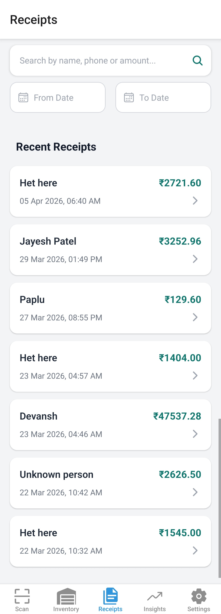 |
| **10. Receipt Description Page** | 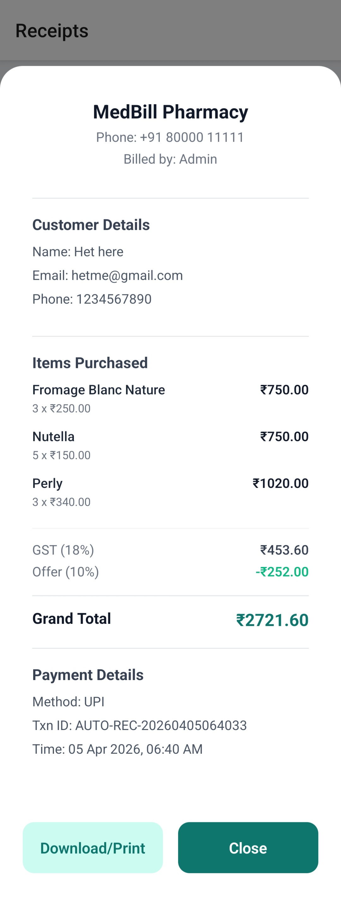 |
| **11. Insights Page** <br> *(ML-based recommendations)* | 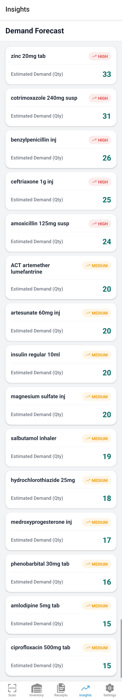 |
| **12. Settings Page** | 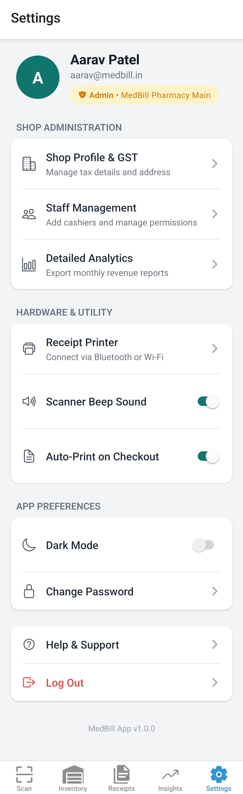 |

---